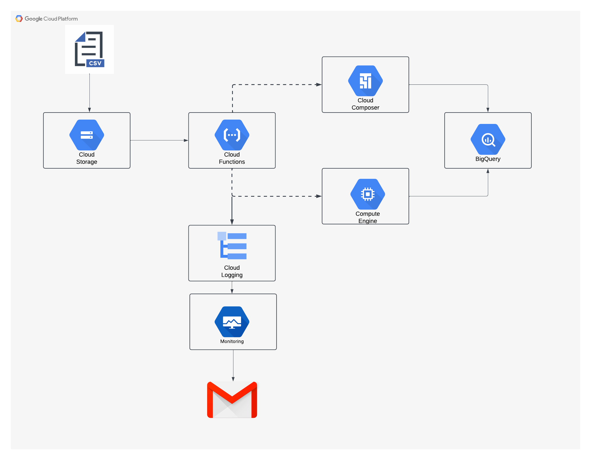

# GCP Data Engineering Project: Data Pipeline with Cloud Run Functions and Airflow 🚢

This project will build a pipeline in GCP, using event driven architecture, which will leverage services like google cloud run, cloud storage and big query.
For managing airflow we'll use both:
- a virtual machine on GCP
- cloud composer
we will then use logging and monitoring services to track the pipelines health.

## Architecture

🗃️ Cloud Storage: A highly scalable and durable object storage service for storing data of all types, including images, videos, and data files.

⚡ Cloud Run functions: A serverless platform for running code in response to events, such as file uploads or database changes.

💽 Compute Engine: A virtual machine (VM) service for running custom applications on Google Cloud's infrastructure. For this porject we will use a vm for hosting airflow.

✨ Cloud Composer: A fully managed service for running Apache Airflow, a popular open-source workflow orchestration platform.

🧮 BigQuery: A fully managed, serverless data warehouse which allows large datasets to be analyzed. 

🧾 Cloud Logging: A fully managed, real-time log management service .

📈 Cloud Monitoring: A service for observing the performance, availability, and health of your infrastructure and applications.

This project was born from the harsh reality that, while I'm still eager to build data engineering projects with Airflow on GCP, Composer 2 is no longer available for free. To address this, I've outlined two options for completing the project:

Option 1: Airflow on a VM. This is the most cost-effective approach. You can even complete it using the GCP Free Trial account (which provides $300 for 90 days). While it requires a bit more manual setup, I'll guide you through each step.

Option 2: Cloud Composer. I tested this solution with both Composer 2 and the preview release of Composer 3. Unfortunately, Google's recent policy change (effective May 11th) means you can't create Composer 2 environment using a Free Trial account. The minimum requirement for even the Small Composer is 600GB of Persistent Disk SSD, which exceeds the Free Trial quota of 500GB. To use this option with Composer 2, you'll need to activate your GCP account.

Screenshot (1912)2

Screenshot (1911)2

this project will use the PortWatch IMF Daily Port Activity Data and Trade Estimates dataset. This dataset provides daily counts of port calls, as well as estimates of import and export volumes (in metric tons) for 1642 ports worldwide. It leverages real-time data on vessel movements, specifically Automatic Identification System (AIS) signals, as its primary data source. This dataset contains over 3.3 million rows.

date: all port call dates are expressed in UTC.

year: as extracted from date.

month: month 1–12 extracted from date.

day: day 1–31 extracted from date.

portid: port id. Full list of ports and associated additional information can be found here.

portname: port name.

country: country the port resides in.

ISO3: ISO 3-letter country code of the port.

portcalls_container: number of container ships entering the port at this date.

portcalls_dry_bulk: number of dry bulk carriers entering the port at this date.

portcalls_general_cargo: number of general cargo ships entering the port at this date.

portcalls_roro: number of ro-ro ships entering the port at this date.

portcalls_tanker: number of tankers entering the port at this date.

portcalls_cargo: total number of ships (excluding tankers) entering the port at this date. This is the sum of portcalls_container, portcalls_dry_bulk, portcalls_general_cargo and portcalls_roro.

portcalls: total number of ships entering the port at this date. This is the sum of portcalls_container, portcalls_dry_bulk, portcalls_general_cargo, portcalls_roro and portcalls_tanker.

import_container: total import volume (in metric tons) of all container ships entering the port at this date.

import_dry_bulk: total import volume (in metric tons) of all dry bulk carriers entering the port at this date.

import_general_cargo: total import volume (in metric tons) of all general cargo ships entering the port at this date.

import_roro: total import volume (in metric tons) of all ro-ro ships entering the port at this date.

import_tanker: total import volume (in metric tons) of all tankers entering the port at this date.

import_cargo: total import volume (in metric tons) of all ships (excluding tankers) entering the port at this date. This is the sum of import_container, import_dry_bulk, import_general_cargo and import_roro.

import: total import volume (in metric tons) of all ships entering the port at this date. This is the sum of import_container, import_dry_bulk, import_general_cargo, import_roro and import_tanker.

export_container: total export volume (in metric tons) of all container ships entering the port at this date.

export_dry_bulk: total export volume (in metric tons) of all dry bulk carriers entering the port at this date.

export_general_cargo: total export volume (in metric tons) of all general cargo ships entering the port at this date.

export_roro: total export volume (in metric tons) of all ro-ro ships entering the port at this date.

export_tanker: total export volume (in metric tons) of all tankers entering the port at this date.

export_cargo: total export volume (in metric tons) of all ships (excluding tankers) entering the port at this date. This is the sum of export_container, export_dry_bulk, export_general_cargo and export_roro.

export: total export volume (in metric tons) of all ships entering the port at this date. This is the sum of export_container, export_dry_bulk, export_general_cargo, export_roro and export_tanker.

## Airflow on GCP VM
- VM was first created in compute engine page
- debian image was used
- installed all necessary python and airflow packages
- for simplicity I used sqlite for the airflow metadata database, however a postgresql database should should be used for production enviroment.

## ⚡Cloud Run Function

## ✨ Cloud Composer

